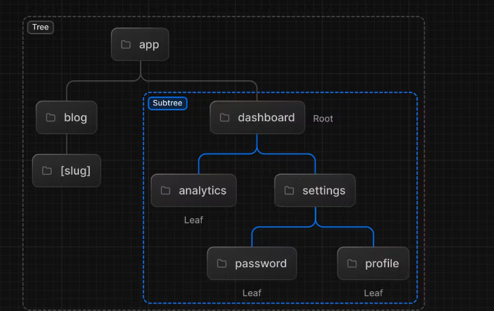
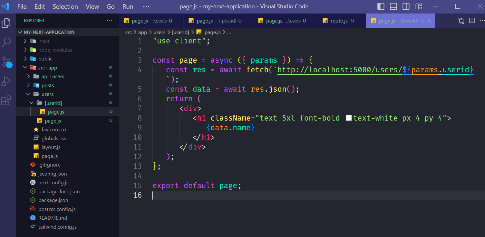
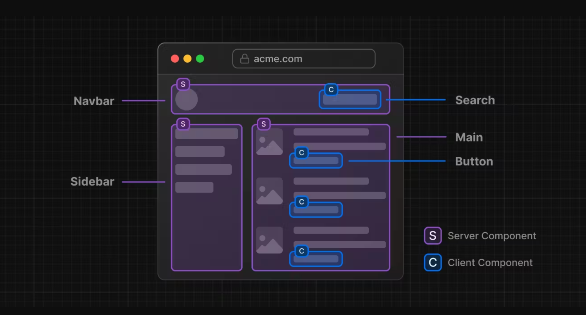

# Next Js Documentation :-

## What is next Js ?

-  ##### Next JS is an open source, light weight React JS Framework that helps us to develope a full-stack web application.
-  ##### Next Js is not a fully new technology. It's still fundamentally built in top of react.
-  ##### Next JS is a React Js Framework , that helps us to build a superfast and extremly user-friendly static website.
-  ##### Next.js is a flexible React framework that gives you building blocks to create fast web applications.
-  ##### Next js handles toolings and configurations for React Application
-  ##### Next Js Provides Additional Structures, Features and Optimizations for your Application.

## Features of Next Js :

-  ##### Build In Optimization : ( Font, Image, Script etc optimizations)
-  ##### React Server Component
-  ##### Dynamic HMTL Streaming
-  ##### Data Fetching
-  ##### CSS Supports
-  ##### Clinet & Server Side Rendering
-  ##### Dynamic Routing
-  ##### Powerful Layouts
-  ##### API Routes
-  ##### Middleware
-  ##### Node Js & Edge Runtime.
-  ##### SEO Friendly Website
-  ##### File Based Routing
-  ##### Nested Routes

## Why we use Next.js ?

-  ##### SEO Friendly websites
-  ##### Server Side Rendering (SSR)
-  ##### Static Side Generation (SSG)
-  ##### Client Side Rendering (CSR)
-  ##### Super Fast
-  ##### Easy to Scan
-  ##### File Based Routing
-  ##### Dynamic & Nested Routing
-  ##### Api Routing
-  ##### Support for CSS modules (CSS for each page)
-  ##### Image optimization
-  ##### TypeScript Support & Fast Refresh
-  ##### Development & Production build system.

## What can we build with Next.js ?

-  ##### :point_right: MVP - Minimum Viable Product
-  ##### :point_right: Single Page Application / Website
-  ##### :point_right: JamStack Websites
-  ##### :point_right: Ecommece & Retails websites.
-  ##### :point_right: Complex and demanding web applications.

## Next JS Installation :

-Step 1: Run Command :

```bash
npx create-next-app@latest
```

```bash
- What is your project named? my-app
- Would you like to use TypeScript with this project? No / Yes
- Would you like to use ESLint with this - - project? No / Yes
- Would you like to use Tailwind CSS with this project? No / Yes
- Would you like to use `src/` directory with this project? No / Yes
- Use App Router (recommended)? No / Yes
- Would you like to customize the default import alias? No / Yes
```

-  wait for install........
-  After Installing run the project with ` npm run dev`

## What is Server Side Rendering ?

-  Server-side rendering involves the rendering of the web page on the server
   before delivering it to the client’s device. When a user requests a page, the
   server renders the component on the server side, then sends the fully
   rendered HTML to the client, enabling immediate display. This process allows
   your website to be visible to the user quickly, providing an enhanced user
   experience.

## What is Server Side Rendering or SSR ?

-  SSR Means Server Side Rendering
-  With SSR, You can render JavaScript on Server Side and send the indexable
   HTML File to the user.
-  The HTML Generated During Run Time and reach to Users and Search Engines at
   same time.
-  SSR pages are generated upon request.
-  SSR only executes on server.
-  It's Never Run on Browser.
-  যখন ইউজার এর প্রতি রিকুয়েস্টে নতুন করে ডাটা জেনেরেট করতে হবে তখন আমরা SSR
   ব্যবহার করবো।
-  SSR is Faster then CSR.
-  For Every Request Needs to rebuild the components .
-  `getServerSideProps() : ` We can use get Static Props for serverside
   rendering
-  ### Server Side Rendering process in Next Js

   -  Create a async component
   -  then try to load data with fetch
   -  pass `{cache: 'no-store'}` as as second parameter to load data with server
      side rendering.
   -  Example :

   ```js
   const page = async () => {
      const res = await fetch(`http://locahost:5000/users`, {
         cache: "no-store",
      });
      const users = await res.json();

      return (
         <div>
            {users.map((u) => (
               <h2 key={u._id}>{u.name}</h2>
            ))}
         </div>
      );
   };
   ```

## What is SSG ? What is Static Site Generation ?

-  SSG Means Static Side Generation.
-  With SSG you can render your javaScript Code on Build Time and Generated Your
   Static HTML Files.
-  After generated Static files on built time , We store our static files on
   Server.
-  আর ইউজার রিকুয়েস্ট করার আগে যদি কোনো একটা ফাইল তৈরী করে রাখতে চাই এবং ইউজার
   রিকুয়েস্ট করার সাথে সাথে দেখাবো সেই ক্ষেত্রে আমরা SSG ব্যবহার করবো ।

-  SSG is Faster than SSR
-  SSG hepls you to build static data in built time. -` getStaticProps()` and
   `getStaticPaths()`: We can use getStaticPaths() and getStaticProps() for
   static site generation.

-  ### Static Site Generation Process :

   -  Create an async component .
   -  `fetch `data with `async function ` without using `{cache: 'no-store'}` as
      `second parameter`
   -  Example :

   ```js
   const page = async () => {
      const res = await fetch(`http://locahost:5000/users`);
      const users = await res.json();

      return (
         <div>
            {users.map((u) => (
               <h2 key={u._id}>{u.name}</h2>
            ))}
         </div>
      );
   };
   ```

-  #### Incremental Static Generation Process:

   -  This feature lets you update static content without having to rebuild the
      entire site. You can revalidate and update static pages in the background
      as traffic comes in, ensuring content is fresh while still providing the
      benefits of static generation.
   -  Create an async componnet.
   -  Then try to load data with `fetch` by using `await `
   -  `{next: {revalidated: time as milliseconds }}` add as second parameter of
      `fetch `. -Example :
   -  ```js
         import Link from "next/link";

         const page = async () => {
            const res = await fetch(`http://localhost:5000/users`, , {
               next: {revalidate:  10}
            });

            const data = await res.json();

            return (
               <div>
                  <h2>Users </h2>
                  <div className="grid grid-cols-4 gap-4 capitalize">
                     {data.map((u) => (
                        <div
                           className=" bg-blue-500 px-4 py-2 text-white border-1 rounded-md border-red-500 "
                           key={u._id}
                        >
                           <h1 className="uppercase text-white text-center">{u.name}</h1>
                           <Link href={`users/${u._id}`}>Details</Link>
                        </div>
                     ))}
                  </div>
               </div>
            );
         };

         export default page;
      ``
      ```

## What is CSR ? What is Client Side Render ?

-  CSR Means Client Side Rendering.
-  Client-side rendering, or browser rendering, is a process where the browser
   downloads the HTML, CSS, and JavaScript code from the server, then renders it
   and finally displays it on the website.
-  With CSR Your website generate HTML pages or files on Client side after
   downloading from server for every user request
-  CSR is not SEO Friendly
-  We can use useEffect to impliment Client Side Rendering in Our next
   appliaction.

## Folder Structure of Next JS:

-  ##### `Readme.md` - Readme.md file contains documention about project
-  ##### `package.json` - package.json file contains scripts, installed dependencise and meta data.

-  ##### `package-lock.json` - package-lock.json file contains Dev Dependencies of our project.
-  ##### `next.config.js` - we can add our all configuration for next js framework at `next.config.js` file.

-  ##### `jsconfig.json` - we can add our javaScript configarations at `jsconfig.json` file.

-  ##### `.gitignore` : .gitignore contains the file name which we cann't want to push on github or gitLab or others .

-  ##### :file_folder:`.next `: After `npm run build ` the :file_folder: .next created. It's contains all build related files after building our project.

-  ##### :file_folder: `node_modules` : `node_modules` folder contains all details about libraris and installed packages.

-  ##### :file_folder: `public`: `public` folder contains all public static resources like images, files, documents etc.

-  ##### :file_folder:`src` : :file_folder:`src` contains :file_folder:`app` folder.

-  ##### :file_folder:`src/`:file_folder:`app/` : app folder contains some pages, layouts, styles etc.
   -  ##### The file under :file_folder:`app/`:
   -  ##### `favicon.ico`: It's the favicon of our website.
   -  ##### `layout.js` :`layout.js` file the main Entry file of our Next Js Website . Which get all `Pages` of our website as `children`
   -  ##### `page.js` : `page.js` is the Home page of our website.

## Routing in Next Js:

-  ### File Based Routing :

   -  Next Js Follows file based routing.
   -  When a file added to the :file_folder:`src/app ` folder in a project by
      default all file become available as route
   -  Home Page Routing : ` "src/app/page.js"`
   -  Other Page Routing : `"src/app/Folder_name_of_page/page.js"`

   -  ##### For making a route follow below instruction :
      -  Open `src/app`
      -  Create a folder with `page_name `and `open `
      -  Create a `page.js` or ` page.tsx`or`page.jsx`or`page.ts ` file

### Nested Routing In Next js :-

-  Nested Route is a route within another route.
-  Nested routes help in the categorization of web pages.
-  Nested route helps to create multiple sub-routes into root directory.
-  Nested route syntax : `root/segment/leaf segment` :arrow_right:
   `app/dashboard/settings` or `app/dashboard/addinfo`.

-  The try to load your page by `http://localhost:3000/dashoboard/settings`
-  Example Image: 

### Dynamic Routing:-

-  When you don't know the extract sengment name and want to create route from
   dynamic data , you can use dynamic routes.
-  A Dynamic Segment can be created by wrapping a folder's name in
   `square brackets`: `[folderName]`. For example, `[id]` or `[slug]`.
-  Dynamic Segments are passed as the` params` prop to `layout`, `page`,
   `route`, and `generateMetadata` functions
-  #### How to create a dynamic route:

   -  make a folder and wrapping the folder name with `squre brackets`. like:
      :file_folder:[your_folder_name]
   -  then create a file with name page.js
   -  you can access the dynamic `id` or `slug` in your `layout.js` , `page.js`,
      `route.js` as props.
   -  Example:

   ```js
   "use client";

   const page = async ({ params }) => {
      const res = await fetch(`http://localhost:5000/users/${params.userid}`);
      const data = await res.json();
      return (
         <div>
            <h1 className="text-5xl font-bold text-white px-4 py-4">
               {data.name}
            </h1>
         </div>
      );
   };

   export default page;
   ```

   -  

## Link :

-  **`Link`** component is a built in component of `Next.js`
-  **`Link`** component helps us to navigate one page to another page.
-  **`Link`** component has a **`href="/path"`** attribute which get `paths` as
   value

## `useRouter()` for Navigation :

-  we use use router for navigation.
-  use router return a object.
-  the object contains `back()` , `fastRefresh()`, `push()`, `forward()`,
   `push()`, `replace()`, `refetch()`.

   -  `router.push()` helps us to `navigate one page another page `
   -  `router.back()` helps us to`back()` from `previous route`.
   -  `router.forword()` helps us to `navigate` from which route we `back()`

-  ##### **How to **`Link`** component ?**

   -  Import Link from `'next/link'`

   ```js
   import Link from "next/link";
   ```

   -  Example :

   ```js
   import Link from "next/link";

   const page = () => {
      return (
         <div>
            <nav>
               <Link href="/">Home</Link>
               <Link href="/about">About</Link>
               <Link href="/login">Login</Link>
            </nav>
         </div>
      );
   };

   export default page;
   ```

## Layout :

-  helps us to create a common layout.
-  A layout is UI that is shared between routes.
-  A root layout is the top-most layout in the root `app` directory.
-  The root layout must define `<html>` and `<body>` tags.
-  Layout component should be accept and use a `children` prop.
-  Example :

   ```js
   import { Inter } from "next/font/google";
   import Link from "next/link";

   const inter = Inter({ subsets: ["latin"] });

   export const metadata = {
      title: "Create Next App",
      description: "Generated by create next app",
   };

   export default function RootLayout({ children }) {
      return (
         <html lang="en">
            <body className={inter.className}>
               <nav>
                  <Link href="/">Home</Link>
                  <Link href="/about">About</Link>
                  <Link href="/blog">blog</Link>
                  <Link href="/login">login</Link>
               </nav>
               {children}
            </body>
         </html>
      );
   }
   ```

# Interview Questions:

## 1. How to Use Event in Next Js Component ? or `Use Client ` or ` Client Component`

-  ### What is use Client ?
   -  `"use Client" ` is a convention.
   -  To use a Client Component, create a file inside app and add the
      ` "use client"` directive at the top of the file (before any imports).
   -  `"use client"` enables client interaction on a next js component.
-  ### How to use `"use client"` & create client component?

   1. Create a Component.
   2. Write `use client` at top of the component otherwise the componet shows
      error and not support `event`
   3. `use client` Component helps us to use `events ` in `client side`.
   4. Without writing `use client` we cann't use `events` in next js.
   5. Example : We Can use a `onClick` event on `<button></button>` . After
      clicking shows an alert.

      ```js
      "use client";
      import styles from "./page.module.css";

      export default function Home() {
         return (
            <main className={styles.main}>
               <button onClick={() => alert("Hello Next Js Developers")}>
                  Click me
               </button>
            </main>
         );
      }
      ```

## 2. What is Server Component ?

-  Server Component is a component thats renders on server.
-  By default, All component of next js is server side components.
-  They are closer to backend.
-  Server Components are secure and seo friendly

## 3. What is Client Component ?

-  Client Side Component is a component thats renders on client side.
-  We make client component by using `'use client"` directives.
-  All Ui-related code and events should be written here.

## 4. Can we use client & server component same time ?

-  Yes. You can use client and server components at the same time and same page.
-  Example Image:
   ;
